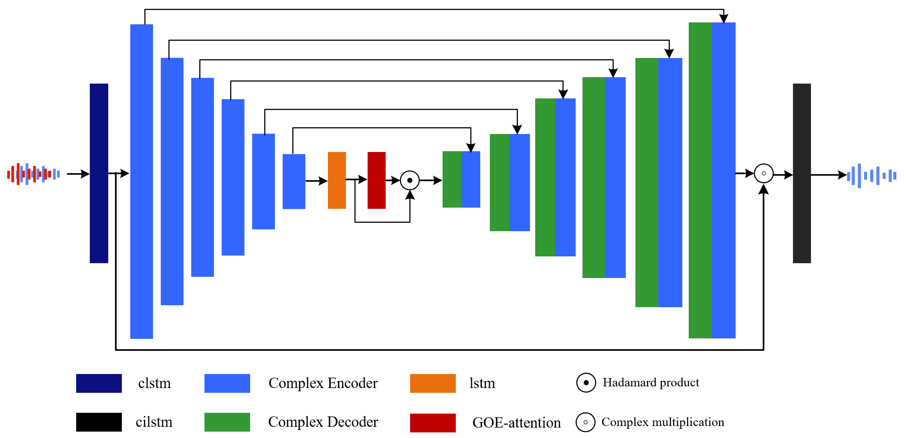
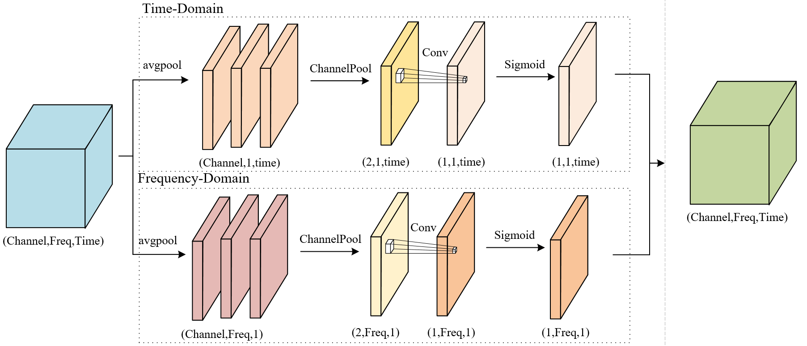
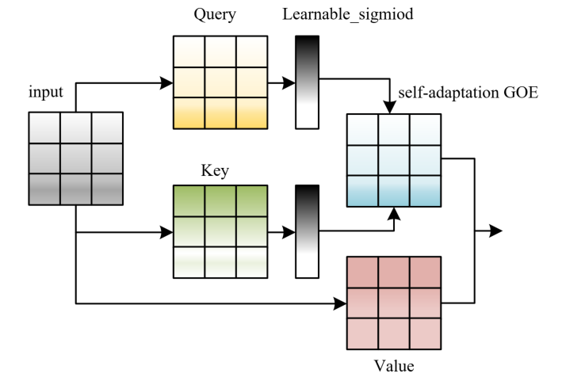
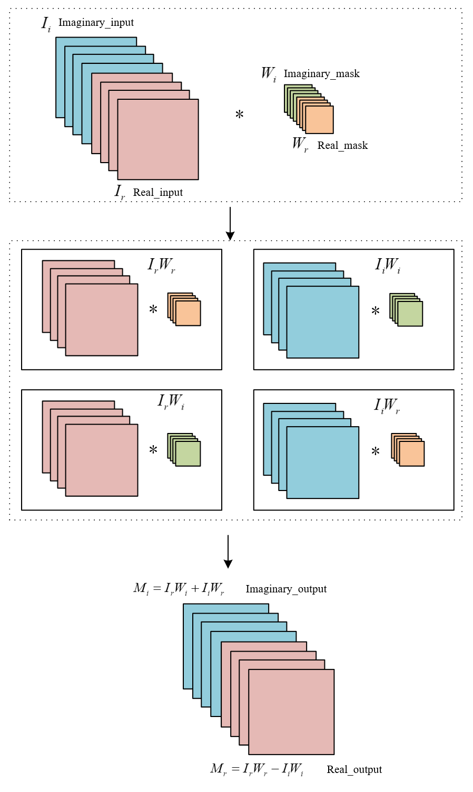
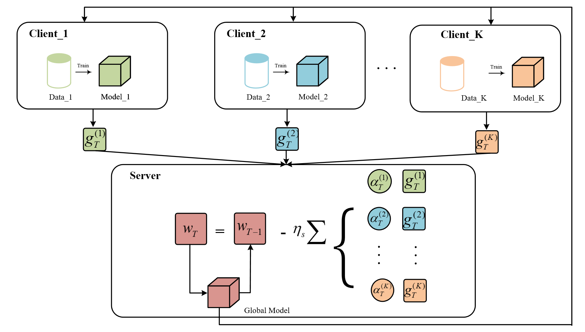

## SASE : Self-Adaptive noise distribution network for Speech Enhancement with heterogeneous data of Cross-Silo Federated learning  

- We propose a SASE model with adaptive noise distribution, which achieves state of the art results on the VioceBank+DEMAND dataset.
- We simulated the federated learning setting of a real environment and verified the robustness of the proposed SASE noise reduction model in a real  environment through experiments and visualization.
- The proposed SASE model is computed based on the complex domain, and the TF-GA block is used to extract richer information of speech distribution and noise distribution, while SA-GOEA and SA-GUEA are adaptive to learn the distribution mask of noise.
- In this paper, we propose a model aggregation optimization weighting strategy that is more applicable to FLbased speech enhancement tasks.  

## Dependencies

- python >=3.6 (3.8.5 was used in the experiments)
- PyTorch == 1.10.0+cu113
- flwr == 2.0.1

## How to run the code

### 1. Prepare data

- VoiceBank+DEMAND can be accessed from this [link]([## SUPERSEDED: THIS DATASET HAS BEEN REPLACED. ## Noisy speech database for training speech enhancement algorithms and TTS models](https://datashare.ed.ac.uk/handle/10283/1942?show=full))
- CommonVoice(Chinese) [link](https://commonvoice.mozilla.org/zh-CN/datasets) +Noise92 [link]([NOISEX (cmu.edu)](http://www.speech.cs.cmu.edu/comp.speech/Section1/Data/noisex.html))

> The data processing code will be compiled and made public as soon as possible.

### 2. Train on the VoiceBank+DEMAND dataset

- python main.py

### 3. Train on the CommonVoice(Chinese)+Noise92 dataset with Federated learning

- ./run-server.sh
- ./run-client.sh 
  - You can change the number of clients by changing NUM_CLIENTS

### 4. Generate wav files and evaluate

- python main.py -g --resume "model_file" -df "wavs_root"

## Network Structure

### 1. TF-SA

### 2. SA-GOEA and SA-GUEA

- SA-GOEA

- SA-GUEA

### 3. FL 

